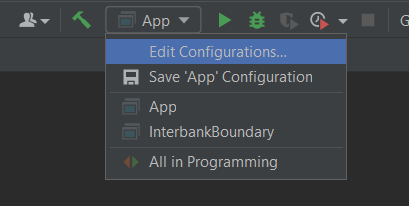
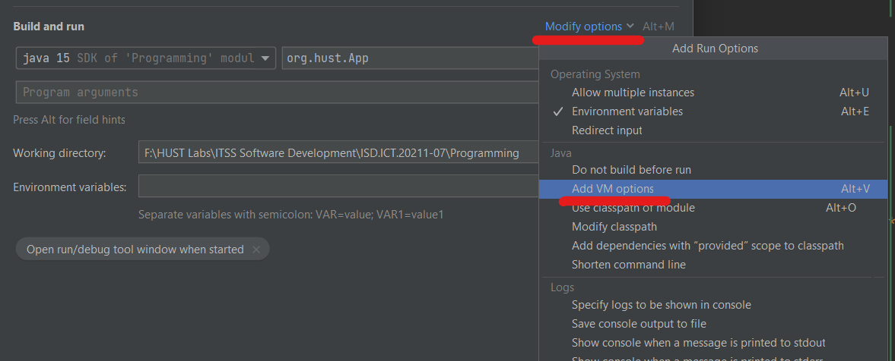

# EcoBike Rental: ITSS Software Development Capstone

## Project structure

```
├── docs                    # Documentation files
│   ├── index.html          # Documentation home page
├── src
│   ├── main
│   │   ├── java            # Source code files
│   │   ├── resources       # Resource files including images, fxml, meta, css,...
│   ├── test                # Test files
├── *.img                   # Illustrations used in README
├── pom.xml                 # Maven dependencies
└── README.md               # README
```

## How to run

### Install dependencies

You can run through CLI:

```shell
maven clean
maven javafx:run
```

Or import this project into IntelliJ and click `Load Maven project`

### Run configurations

1. Run `App.java`
2. Choose `Edit Configurations`



3. `Modify options` > `Add VM options` :



4. Paste the following options in `VM options` field under **Build and Run**

```shell
--add-opens java.base/java.net=Programming --add-opens java.base/java.lang.reflect=Programming
```

If you are using other IDEs, please check its documentation on how to edit run configurations.
